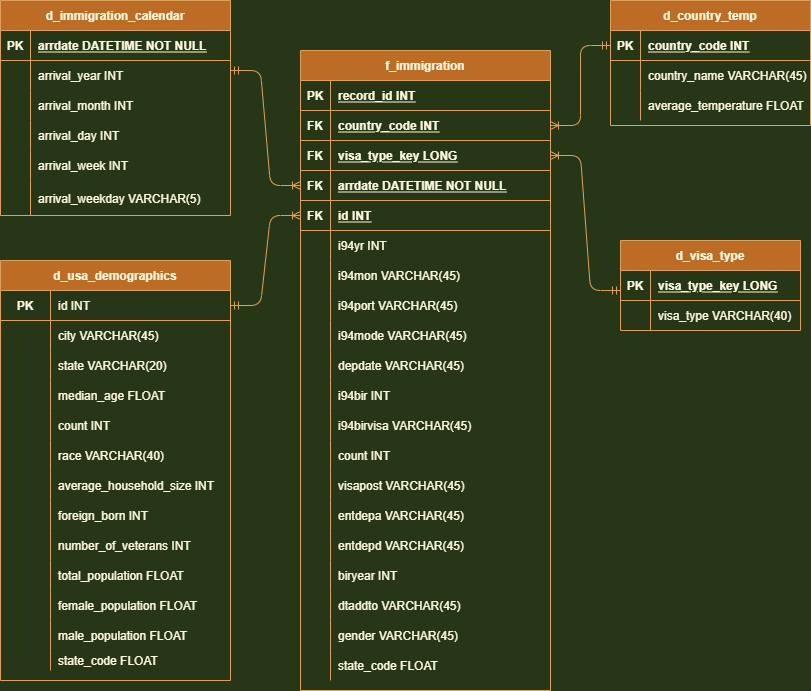

# Capstone Project- US Immigration Analytics

## Introduction

I94 Immigration open ended Data is provided in the workspace to answer various key insights on US Immigration.
Additional data files such as US Cities Demographics and Global temperature city wise also provided in the workspace.

## Objective

Is to be provide anlaytics platform to enable data analyst for finding key insights. For this, need to create Analytics Database. The data to be populated by joining various input data pipeline through ETL tool.

## Data files:

1. **data/18-83510-I94-Data-2016/i94_apr16_sub.sas7bdat** : SAS data in sas7bdat fromat was provided in the workspace in the same filesystem. This files contains data of immigration.

2. **us-cities-demographics.csv**: U.S. Cities Demographic data This data comes from OpenSoft [link](https://public.opendatasoft.com/explore/dataset/us-cities-demographics/export/).

3. **airport-codes_csv.csv**: 
Airport Code Table: This is a simple table of airport codes and corresponding cities. It comes from [here](https://datahub.io/core/airport-codes#data).

4. **Global Temperature Data**: This dataset came from Kaggle [link](https://www.kaggle.com/berkeleyearth/climate-change-earth-surface-temperature-data).

5. **I94_SAS_Labels_Descriptions.SAS**: Data dictionary added in this workspace filesystem for getting description of SAS immigration data.

## Code file:

* **etl.ipynb - Jupyter Notebook** - jupyter notebook file is developed for ETL workload.

## Prerequisites

* Apache Spark
* python3 

### The project follows the following steps:

* Step 1: Scope the Project and Gather Data
* Step 2: Explore and Assess the Data
* Step 3: Define the Data Model
* Step 4: Run ETL to Model the Data
* Step 5: Complete Project Write Up

#### Step 1: Scope the Project and Gather Data

  * Project is to create etl data pipeline to ingest data from datafiles and transform to fit into data model for further storing the it in data warehouse.

#### Step 2: Explore and Assess the Data

* Pyspark is used create dataframe where data from files are extracted.

* Data Cleaning:

  * EDA has been carried about in every dataframes to clean the datasets for missing values to drop the fields. 
  * Rows are deleted for missing values in essential fields and duplicate values.
  * columns are also dropped for which missing values are more than 90%

* Transformation:

  * Date format is transformed from string values of I94 SAS data.
  * From data dictionary file country code is mapped for country name.
  * Aggregate city wise average temperature is calcualted.

#### Step 3: Define the Data Model

* Data Model:
  * Star Schema Data model created with referring the ER Diagram
  * Primary keys identified in dimension table
  * Fact table created and relation with dimention table is defined by join table.

* Data Quality checks are done to confirm:

  * No null value present in unique id of dataframe
  * All values are unique in the key columns.
  * Data is populated in dataframes.
  

#### Step 4: Run ETL to Model the Data:

 To run using `etl.ipynb`

#### Step 5: Complete Project Write Up

1. Rationale for the choice of tools and technologies for the project

  * Apache spark is selected for this project to develop an ETL tool which has following features:

  * Spark enables to extract from various file format including SAS format using config jar files.

  * Apache Spark processes dataframes in-memory enables to develop lightning-fast ETL tools for analytics purpose.
  
  * Spark has vast APIs to work on big data for transformation of datatype to creating SQL Queries

2. US Immigration data is updated monthly hence the data should be updated monthly

3. Using spark we can develop scalable solution, hence Spark can handle data even if data volume increased by 100x

4. For data population of a dashboard that must be updated on a daily basis by 7am every day, the data pipeline (ETL) can be scheduled using Apache Airflow.

5. For multiuser access of data, data should be loaded in a Datawarehouse eg. Amazon Redshift from ETL